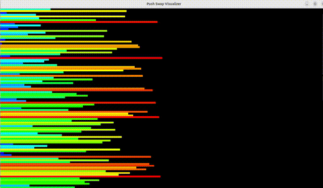

# 🧠 push_swap

## 📑 Table of Contents

- [📚 Description](#-description)
- [🎯 Objectives](#-objectives)
- [🧾 Rules](#-rules)
- [🛠️ Usage](#️-usage)
- [🧪 Strategy: Turkish Sorting Algorithm](#-strategy-turkish-sorting-algorithm)
- [👁️ Example with Visualizer](#️-example-with-visualizer)
- [📁 Project Structure](#-project-structure)
- [✅ Bonus](#-bonus)
- [📦 Compilation](#-compilation)

## 📚 Description

`push_swap` is a sorting algorithm project. Given a stack of integers, the goal is to sort them using **only a limited set of operations** and **output the smallest possible number of moves**.

You must write a program that takes as input a list of integers and outputs the instructions to sort them.

## 🎯 Objectives

- Implement an efficient sorting algorithm in C.
- Optimize the number of moves.
- Practice stacks and algorithms.
- Manage memory carefully.

## 🧾 Rules

- Use only these instructions:
  - `sa`, `sb`, `ss`
  - `pa`, `pb`
  - `ra`, `rb`, `rr`
  - `rra`, `rrb`, `rrr`
- Handle invalid inputs:
  - Duplicates
  - Non-integer values
  - Out-of-range integers
- Output instructions one per line.
- Print `Error\n` on invalid input (to stderr).
- Free all memory on exit.

## 🛠️ Usage

```bash
$ ./push_swap 2 1 3 6 5 8
sa
pb
pb
pb
sa
pa
pa
pa
````

## 🧪 Strategy: Turkish Sorting Algorithm
This implementation uses the Turkish strategy:
  1. Push all elements except 3 from a to b.
  2. Sort the 3 remaining elements in a.
  3. For each element in b, calculate how many moves it takes to place it correctly in a.
  4. Do the cheapest move first.
  5. Once b is empty, rotate a so that the smallest element is on top.
This leads to a smart insertion sort that minimizes the number of instructions.

## 👁️ Example with Visualizer
A sample run of the program with a visual representation of the stacks:



## 📁 Project Structure
````bash
├── Makefile
├── bonus
├── src
├── push_swap.h
├── libft/
````

## ✅ Bonus
A checker program that:
- Reads a list of instructions from stdin.
- Applies them to the input stack.
- Outputs:
  - OK if stack a is sorted and b is empty.
  - KO otherwise.
- Detects invalid instructions and prints Error.

Example:

```bash
$ ./checker 3 2 1 0
rra
pb
sa
rra
pa
OK
````

## 📦 Compilation
```bash
# Compile push_swap
$ make

# Compile with bonus checker
$ make bonus

# Clean build files
$ make clean

# Clean everything
$ make fclean

# Recompile all
$ make re
````
